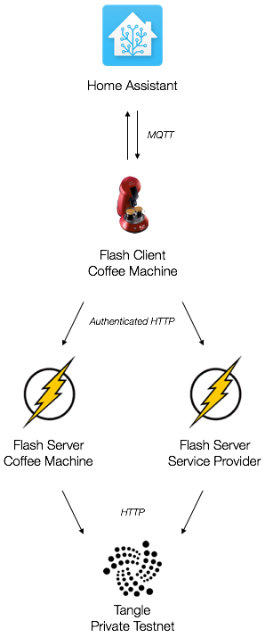

# Flash Home

Proof of concept for integrating IOTA flash channels into home automation systems.

TODO: explain general idea

## Setup

Please clone this repository recursively:

```
git clone --recursive https://github.com/jinnerbichler/flash-home
```

and run it via

```
docker-compose up coffee-client flash-coffee flash-provider
```

in order to execute the protoype on your local machine.

The following endpoints are provided after the startup:

* Home Assistant: [http://localhost:8123](http://localhost:8123) (with UI)
* Flash Server Coffee Machine: http://localhost:3000 (no UI)
* Flash Server Service Provider: http://localhost:3001 (no UI)

**Only Dependencies**:

* Docker
* Docker Compose

## Components

The exemplary setup mainly consists of five components (1) Home Assistant, (2) Flash client of coffee machine, (3) Flash server of coffee machine and (4) Flash server of service profider and (5) a private testnet of the Tangle. An overview of components and their interaction can be seen in the schema below.



### Home Assistant

Home Assistant is an open-source home automation platform running on Python 3. Track and control all devices at home and automate control. Perfect to run on a Raspberry Pi.
At the time of writing more than 950 IoT components are supported, which can be integrated into Home Assistant (e.g. [Phillips Hue](https://home-assistant.io/components/hue/) or [Dyson 360 Eye](https://home-assistant.io/components/vacuum.dyson/) vacuum cleaner).

* Home Assistant: [https://home-assistant.io/](https://home-assistant.io/)
* Config: `home-assistant/config`
* Custom components: `home-assistant/config/custom_components`

This proof of concept integrates a Senseo coffee machine into Home Assistant and utilizes via MQTT messages with the coffee machine. The main part of the configuration can be found in `scrips.yaml`.

### Flash Client of Coffee Machine

### Flash Server of Coffee Machine

### Flash Servier of Service Provider

### Private Instance of Tangle (Testnet)
